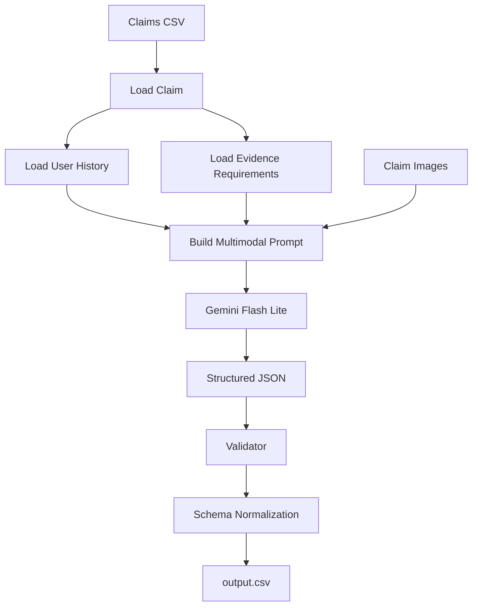

# AI-Powered Multimodal Damage Claim Verification System

An AI-powered multimodal system for verifying insurance damage claims using images, claim conversations, user history, and evidence requirements.

## Overview

This project automates the review of damage claims for:

- Cars
- Laptops
- Packages

The system analyzes uploaded images together with claim descriptions to determine whether the visual evidence supports, contradicts, or is insufficient to verify the claim.

## System Architecture


## Features

- Image-based damage verification using Google's Gemini multimodal model
- Structured JSON output generation
- Automated schema validation and normalization
- Support for multiple uploaded images per claim
- Risk detection for:
  - Wrong object
  - Wrong object part
  - Prompt injection attempts
  - Non-original images
  - User history risk
  - Missing or insufficient evidence
- Evaluation pipeline for measuring prediction accuracy

## Tech Stack

- Python
- Google Gemini Vision API
- Pandas
- Pillow
- CSV Processing
- Prompt Engineering
- JSON Parsing
- Structured Output Generation
- Rule-Based Validation
- Data Validation

## Skills Demonstrated

- Multimodal AI
- Image Processing
- API Integration
- Prompt Engineering
- Data Validation
- JSON Processing
- Rule-Based Systems
- Software Testing
- CSV Data Processing

## Workflow

1. Load claim information from the input dataset.
2. Retrieve corresponding user history and evidence requirements.
3. Load one or more submitted images.
4. Generate a multimodal prompt combining text and images.
5. Use Gemini Flash Lite to evaluate the evidence.
6. Produce structured JSON predictions.
7. Validate and normalize outputs.
8. Export the final predictions to `output.csv`.

## Project Structure

```
code/
├── main.py
├── validator.py
└── evaluation/
    ├── main.py
    └── evaluation_report.md
```

## How to Run

Install dependencies:

```bash
pip install -r requirements.txt
```

Create a `.env` file:

```text
GEMINI_API_KEY=your_api_key
```

Run the prediction pipeline:

```bash
python code/main.py
```

Validate the output:

```bash
python code/validator.py
```

## Validation

The validator performs:

- Schema enforcement
- Enum normalization
- Output consistency checks
- Supporting image ID validation
- Final CSV formatting

## Highlights

- Built an end-to-end multimodal AI pipeline
- Automated post-processing using rule-based validation
- Evaluated on labeled sample claims before inference
- Designed to handle multiple object categories and edge cases

## Disclaimer

This repository contains only the implementation code. Competition datasets, images, and proprietary evaluation files are not included.